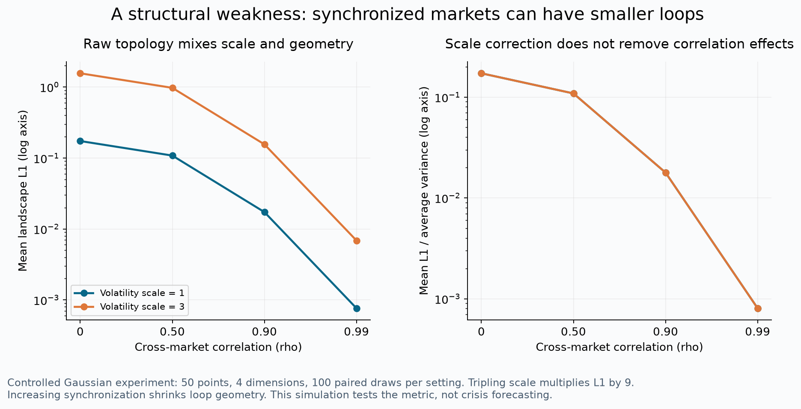
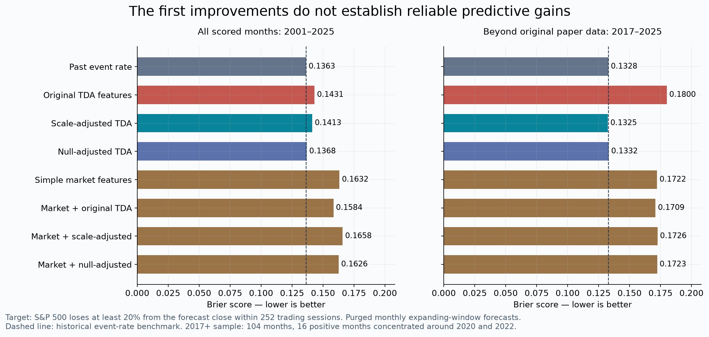
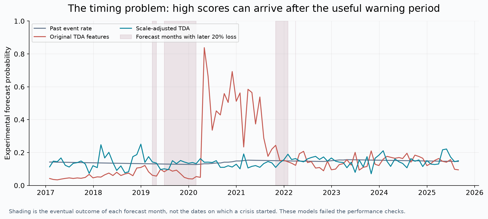

# 方法缺陷、改进实验与结论

日期：2026-09-28。本轮实际执行了控制模拟、两种改进、8 个基准/消融模型和按时间推进的预测比较。

**结论：原始指标确有可明确解释的缺陷。第一轮校正减少了部分预测误差，但没有证实它能稳定优于简单历史发生率，也没有证明它在普通市场特征之上提供额外预测价值。不能把这轮结果包装成“成功造出了更好的危机预测器”。**

真正系统性金融危机的研究设计另见 `SYSTEMIC_RESEARCH_PLAN.md`。本轮预测的是股价尾部损失，二者不能互换。

## 1. 原方法哪里不足

| 不足 | 依据 | 改进方向 | 本轮是否测试 |
|---|---|---|---|
| 波动变大会直接放大拓扑范数 | 距离整体乘 c，L1 乘 c² | 把尺度与形状拆开 | 已测试 |
| 协同性增强可能让环消失 | 相同收益率的四维点落在一条直线上 | 同期相关性校准；同时描述同步/连通结构 | 前者已测，H0/网络扩展未测 |
| 指标不含涨跌方向 | 点云整体取负，所有距离和 H1 不变 | 加入趋势、回撤和下行风险特征 | 已测试联合模型 |
| 窗口及去趋势选择影响信号 | 前轮低频谱敏感性实验出现符号变化 | 预先固定多尺度，不事后挑最像危机的曲线 | 已固定 50/100 日 |
| 高分位没有自然对应的预测期限与概率 | 原论文没有完整概率映射及全时期误报验证 | 明确定义目标，在成熟标签上逐期训练 | 已实施 |
| 四个美国股指高度重叠，缺少信用/融资信息 | 输入范围本身可核查 | 增加银行、债务、流动性和跨国信息 | 第二方向设计，尚未跑全球模型 |
| 两个漂亮事件图容易掩盖平静期与失败事件 | 事件选择不能给出完整分母 | 全部可用月份比较，危机外时期同样计入 | 已实施 |

此外，按论文持续景观的定义，统一缩放 c 后，Lp 范数的缩放是 c^(1+1/p)。L1 为 c²，L2 为 c^(3/2)。原文 3.3 节把两者都概括为与方差成正比的表述不够准确。这不推翻其全部实证，但提醒我们不能把范数数值误读成与单位无关的风险强度。

## 2. 控制实验：确认缺陷，而不是只讲道理

设四维 Gaussian 点云，50 个点，各维方差相同，只改变相关性 rho。每个配置做 100 次独立模拟；同一抽样的整体尺度另乘 3，形成配对对照。

| 各维相关性 | 单位波动尺度的平均 L1 | 3 倍波动尺度的平均 L1 |
|---|---:|---:|
| 0 | 0.173111 | 1.558002 |
| 0.5 | 0.108017 | 0.972152 |
| 0.9 | 0.017279 | 0.155508 |
| 0.99 | 0.000763 | 0.006865 |

共同尺度放大 3 倍，L1 放大约 9 倍；相关性从 0 升至 0.99，L1 降低超过 99%。在所有资产一起运动时，点云趋近低维直线，环减少。因此“环越大就越危险”没有普遍的单调关系。这是度量性质的实验，不是人工模拟了一场真实危机。



## 3. 实际测试的两个改进

**A：尺度拆分。**用 L1 除以窗口内四指数平均日方差，提取共同幅度以外的形状信息；同时使用 50/100 日水平和较 63 个交易日前的变化。在联合模型中保留普通波动率信息，避免把真实风险信息随“去噪”一起丢掉。

**B：匹配协方差的随机对照。**每个月、每个窗口生成 64 组与当时估计协方差一致的 Gaussian 点云，比较观测 L1 的 log 值与对照分布，提取标准化偏离及月度变化。协方差由当时已有数据估计。它测试“是否超过这个特定随机模型的预期”，不是普适显著性检验；厚尾与波动聚集尚未完全控制。

这两种想法不在这里宣称首创。已有研究使用 surrogate/null 对照验证金融拓扑结构：[Akingbade，2026](https://arxiv.org/html/2602.00383v2)。本轮独立实现的重点是测试这些校正能否改善指定预测目标。

为了分辨改善来自哪里，还比较原始 TDA、普通市场特征、普通特征加原始 TDA/改进 TDA。所有训练型模型使用相同的正则化逻辑回归、相同训练数据和按训练集拟合的缩放方法。原论文自身并没有这样的分类器，因此 tda_raw 是统一评估框架中的原始特征基线，不能等同于作者发布了这个预测模型。

## 4. 实验如何避免把回顾当预测

- 每个完整月末收盘后预测，预测标签从下一交易日开始。
- 主任务：未来 252 个交易日内，标普是否跌到预测时点价格的 80% 以下。
- 辅任务：未来 126 个交易日内，是否跌到预测时点价格的 85% 以下。
- 训练时，只能使用预测窗口已经完整结束、末日严格早于当期的标签。尚未知的最新结果保持 UNKNOWN。
- 同一比较中的 8 个模型使用完全一致的预测月份。参数事先固定，无事后阈值/期限/模型搜索。
- 最少 84 个成熟训练月、5 个正例。这个条件使 12 月任务可评分区间从 **2001-08-31** 才开始，至 **2025-08-29**，共 **289 月、43 个正标签月**。所以本轮不能声称完成了 2000 年以前独立预测。
- 2017 年之后有 **104 个可评分月，16 个正标签月**，主要对应 2020、2022 年的未来损失。它们不是 16 场独立危机。
- 辅任务共 297 月、44 个正标签月，评分截止 2026-02-27。
- 此前已经看过全历史图，因此这是冻结规则后的探索性历史 walk-forward 回测，不是彻底未见数据的最终盲测。

完整实验方案在 `IMPROVEMENT_PROTOCOL.md`，冻结内容的 SHA256 在 `improvement_results/run_manifest.json`。

## 5. 结果：校正没有建立可用的预测优势

Brier 是概率与实际 0/1 结果的平方误差平均值，越低越好。它同时惩罚错误排序和错误的概率幅度。“历史发生率”基准每月只使用当时成熟训练标签的平均发生率。

| 12 月任务模型 | 全部评分月 Brier | 2017 年以后 Brier |
|---|---:|---:|
| 只用历史发生率 | **0.1363** | 0.1328 |
| 原始 TDA 特征 | 0.1431 | 0.1800 |
| 尺度校正 TDA | 0.1413 | **0.1325** |
| 随机对照校正 TDA | 0.1368 | 0.1332 |
| 普通市场特征 | 0.1632 | 0.1722 |
| 普通特征 + 原始 TDA | 0.1584 | 0.1709 |
| 普通特征 + 尺度校正 | 0.1658 | 0.1726 |
| 普通特征 + 随机对照校正 | 0.1626 | 0.1723 |

尺度校正在 2017 年以后较原始 TDA 的 Brier 下降约 **26.4%**，但只是回到了与历史发生率几乎相同的水平。它在全部评分月仍落后于历史发生率。2017 年以后尺度校正模型的 ROC-AUC 为 **0.4645**，并没有表现出有用的风险排序。

6 月任务在 2017 年以后的 Brier 分别为：历史发生率 **0.1328**、原始 TDA **0.1527**、尺度校正 **0.1361**、随机对照校正 **0.1335**。同样没有跨期限的稳定优势。

普通价格特征在本轮也没有建立稳定预测优势。这意味着不能把“再加一个机器学习分类器”当作已经解决问题，更不能因某个消融版本偶有改善就宣称成功。



**不确定性与归因：**对固定样本外预测作 500 次、24 月移动块 bootstrap。2017 年以后，尺度校正相对原始 TDA 的 Brier 差为 −0.0475，95% 区间约 **[−0.1416, +0.0013]**，仍跨零；全部评分月的对应区间为 **[−0.0455, +0.0270]**。market_null 相对 market 的全样本差为 −0.0006，区间 **[−0.0037, +0.0025]**，也跨零。这里的 bootstrap 不包含重新训练和研究者方案选择的全部不确定性，不能夸大其精度。

按固定训练分数第 90 分位报警时，2017 年以后的 12 月原始 TDA 产生 14 个报警月，未命中正标签月；尺度校正为 13 个报警月，命中 1 个正标签月。这个阈值本身未经部署级优化，但足以说明本次不能交付有效的报警器。



## 6. 对 idea 的修正

本轮支持的是“指标混合了尺度和结构、且可能在同步化时减小”这两个度量判断。它**没有支持**“移除尺度或匹配协方差以后就能更准确预测未来 6–12 个月大跌”的强主张。

更合理的下一步是把问题拆成不同状态：平静但脆弱、局部压力上升、风险已经扩散。分别衡量波动、同步、局部分化、信用和流动性，再问拓扑是否提供额外的信息。单纯追求“更大的环”或“更干净的环”不应成为优化目标。

这个调整仍是假说，不能因为听起来合理就宣称有效。下一轮若研究新的图结构或 H0，必须与平均相关性、协方差特征值、普通变化点检测等更简单方法比较，不能只击败原始 L1。

## 7. 验证与复现

- 新增 3 组单元测试通过：预测窗口/UNKNOWN、完整月末、随机对照可复现性与涨跌反射不变性。
- 独立核对 **840 个成熟标签**，确认没有把当期之前损失计入未来标签。
- **24 次**仅用预测时点以前的数据重训与已保存预测一致。
- **4 次**随机对照重算一致，手算复核 16 个 2017+ Brier 值。
- 所有模型使用相同预测月份；所有训练标签末日早于预测日期。

复现命令：

```sh
.venv/bin/python -m pytest -q test_improvement.py
.venv/bin/python improvement_experiment.py
.venv/bin/python verify_improvement.py
.venv/bin/python improvement_figures.py
```

逐月预测、成熟训练样本量、标签末日、指标、误报漏报和 bootstrap 区间位于 `improvement_results/`。这里没有将未校准的当前模型分数转述成 2026 年金融危机概率。

## 证据台账

| 主张 | 状态 | 定位 |
|---|---|---|
| 整体尺度与相关性改变原始 L1 | 数学性质及控制模拟支持 | `improvement_results/simulation.csv`；`test_topology.py` |
| 两种改进稳定提高预测准确性 | 本轮未支持 | `improvement_results/metrics.csv`、`paired_block_bootstrap.csv` |
| TDA 在普通价格特征之上提供额外预测价值 | 本轮未建立 | `market_raw/scaled/null` 对 `market` 的成对比较 |
| 所有 TDA 方法都不可能预测危机 | 未检验，不能如此结论 | 仅检验指定输入、特征、学习器与 6/12 月尾损失目标 |
| 更丰富的信用/融资/网络数据可能有帮助 | 文献支持的研究方向，待本项目验证 | `SYSTEMIC_RESEARCH_PLAN.md` |

原方法来源：[Gidea & Katz，2018](https://arxiv.org/html/1703.04385)。数据及前轮拓扑计算来源见 `REPORT.md` 和 `data/sources.json`。
