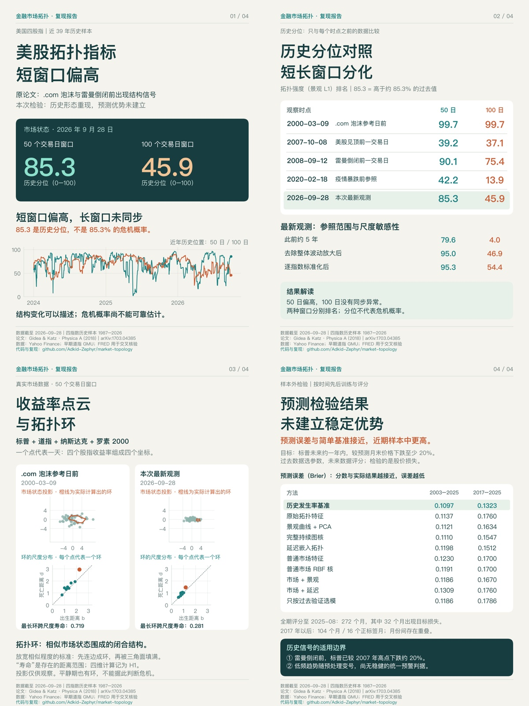

# Financial Market Topology

[中文](#中文报告) · [English](#english-summary) · [Reproduction](REPRODUCIBILITY.md) · [Data sources](DATA_SOURCES.md)

## 中文报告

四个美国股指的拓扑结构分析、历史信号重算与时间顺序预测检验。方法基于 Gidea & Katz 的 *Landscapes of Crashes*，新增尺度对照、持续图核、延迟嵌入和嵌套时间验证。

**数据截至 2026-09-28。短窗口指标偏高，长窗口未同步；所测拓扑模型未建立稳定的预测优势。历史分位不能解释为金融危机概率。**

| 时点 | 50 日历史分位 | 100 日历史分位 |
|---|---:|---:|
| 2000-03-09：互联网泡沫参考日前 | 99.7 | 99.7 |
| 2007-10-08：美股见顶前一交易日 | 39.2 | 37.1 |
| 2008-09-12：雷曼倒闭前一交易日 | 90.1 | 75.4 |
| 2020-02-18：疫情暴跌前参照 | 42.2 | 13.9 |
| 2026-09-28：本次最新观测 | 85.3 | 45.9 |

“50 日”表示最近 50 个交易日。历史分位是与当时之前的指标值比较所得的排名，各窗口分别计算。85.3 表示高于约 85.3% 的过去值，不是 85.3% 的危机概率。



## 指标与预测检验

每天的 S&P 500、DJIA、NASDAQ Composite、Russell 2000 收益率组成一个四维点。取最近 50/100 个交易日，对点云计算 Vietoris–Rips 持续同调。H1 表示一维环；出生、死亡及寿命均按距离尺度衡量，不是日历时间。

预测任务另行定义为：未来 252 个交易日内，标普价格是否较预测月末下跌至少 20%。它不是系统性银行危机标签，也不是任意未来峰谷之间的最大回撤。该分类实验是本项目的扩展，不是原论文已有的预测器。

| 方法 | 2003–2025 Brier | 2017–2025 Brier |
|---|---:|---:|
| 历史发生率 | 0.1097 | 0.1323 |
| 原始拓扑特征 | 0.1137 | 0.1760 |
| 景观 + PCA | 0.1121 | 0.1634 |
| 完整持续图核 | 0.1110 | 0.1547 |
| 延迟嵌入拓扑 | 0.1198 | 0.1512 |

Brier 衡量预测分数与实际结果的误差，越低越好。全部方法、辅助期限及不确定性区间见 [metrics.csv](topology_cv_results/metrics.csv)、[bootstrap.csv](topology_cv_results/bootstrap.csv) 和 [时间验证报告](TOPOLOGY_CV_REPORT.md)。

主任务成熟评分至 2025-08，共 272 个月、32 个正标签月；2017 年以后为 104 个月、16 个正标签月。标签会重叠，不能当作独立危机数量。内层选择参数，外层按年留未来测试，所有训练标签必须先成熟。

## 阅读顺序

- [历史重算报告](REPORT.md)：数据拼接、历史分位、谱处理敏感性与边界。
- [第一轮对照](IMPROVEMENT_REPORT.md)：尺度、协方差 Gaussian 对照和预测比较。
- [第二轮时间验证](TOPOLOGY_CV_REPORT.md)：景观、持续图核、延迟嵌入及联合基线。
- [方法文献](TOPOLOGY_LITERATURE.md)：所用表示方法及证据范围。
- [拓扑环说明](explainer/README.md)：实际代表环、填充链和可核验的数学含义。

## 快速运行

Python 3.12；锁定依赖见 `requirements.lock.txt`。

```bash
git clone https://github.com/Adkid-Zephyr/market-topology.git
cd market-topology
python3.12 -m venv .venv
source .venv/bin/activate
python -m pip install -r requirements.txt
python -m pytest -q
python demo.py
python verify_published.py
```

`demo.py` 只使用数学示例和合成数据；`verify_published.py` 核对仓库保存的分析结果。两者都不下载行情，也不重新训练模型。完整数据重算、历史哈希核对及图片生成见 [REPRODUCIBILITY.md](REPRODUCIBILITY.md)。

`requirements.txt` 提供兼容安装；`requirements.lock.txt` 记录原实验的精确环境，可在对应版本可取得时使用。不同依赖环境应记录版本并核对数值，不能直接称为完全相同环境。

Linux 绘制中文图表时建议使用 Noto Sans CJK SC 字体；报告图生成器会在可用中文字体之间选择。历史绘图脚本使用 PingFang SC，字体差异可能改变文字排版，但不改变数值结果。

## 数据与许可

数据来自 Yahoo Finance，早期道指来自 James E. Gentle / George Mason University 教材数据存档；FRED 仅用于行情交叉核验，未作为预测训练输入。下载地址、时间和 SHA256 见 [data/sources.json](data/sources.json)。

公开包包含原创代码、汇总结果、图表与来源记录；不包含原始供应商价格、收益率表、原始响应或可还原收益率的点云缓存。完整重算须自行取得有权使用的数据。代码的 MIT 许可不授予第三方行情的使用或再分发权限。详见 [DATA_SOURCES.md](DATA_SOURCES.md) 和 [LICENSE](LICENSE)。

## 局限与更新

这是探索性历史研究：仅美国市场、独立事件少、研究过程中已查看历史，无前瞻盲测。原论文部分标准化与谱处理选项不完全明确，本项目不声称逐点复原原作者结果。雷曼倒闭前市场已明显下跌，危机附近高值不等于有效的提前预警。

本仓库不提供经验证的危机概率或交易策略。后续数据与实验更新按独立快照记录，不把旧报告日期改成新日期。更新方法见 [CONTRIBUTING.md](CONTRIBUTING.md)；当前没有自动更新任务。

AI 工具曾用于代码、实验设计与报告辅助；结果由数值检查和测试核验，模型审阅不视为同行评审。可复现步骤和历史验证记录优先于文字主张。

## English summary

Independent method reconstruction and exploratory chronological evaluation of persistent-homology features from four US equity indices, following Gidea & Katz (2018). The saved snapshot ends on 2026-09-28. Elevated historical topology can be reconstructed, but the tested models do not consistently outperform a historical base-rate forecast for future S&P 500 tail losses. Percentiles are descriptive ranks, not crisis probabilities. Raw market inputs are not redistributed; source URLs and hashes are provided for independent acquisition and provenance checking.

## Reference

Gidea, M. & Katz, Y. (2018). *Topological Data Analysis of Financial Time Series: Landscapes of Crashes*. Physica A. [arXiv:1703.04385](https://arxiv.org/abs/1703.04385), [journal DOI](https://doi.org/10.1016/j.physa.2017.09.028).

This repository is an independent implementation and extension, not the authors' official code.
