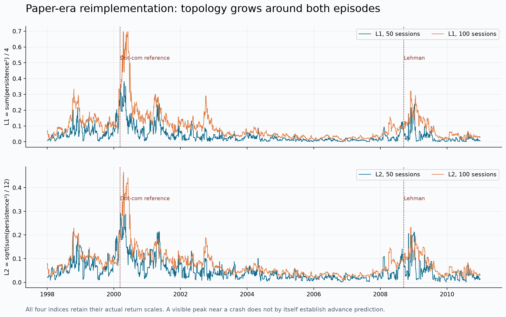
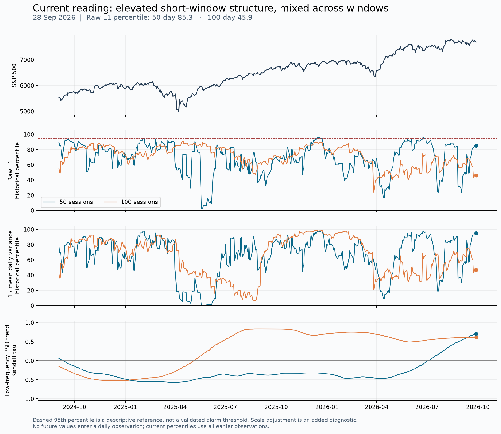
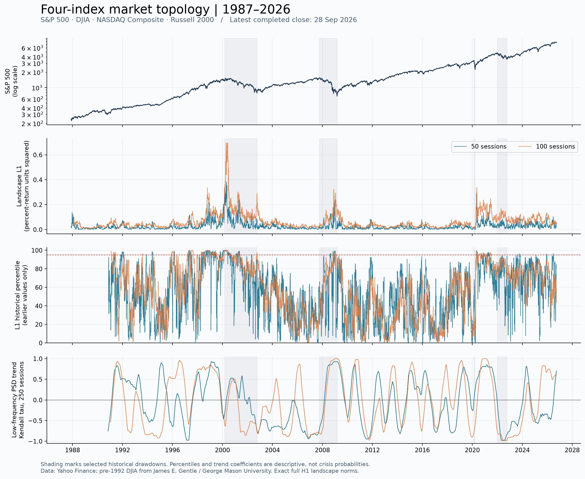
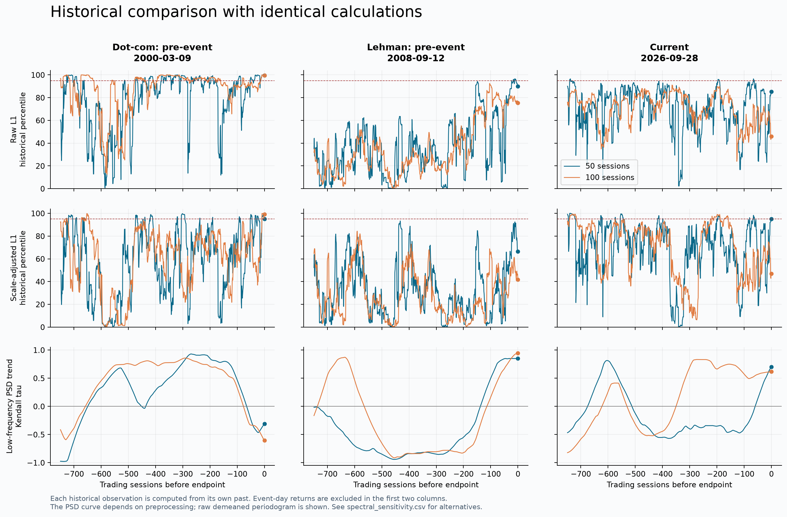

# 拓扑指标历史重算与当前表现

分析时点：2026 年 9 月 28 日美国市场收盘后。已实际运行四指数持续同调计算，范围为美国股票市场。

**结论：2000 年前及 2008 年危机附近的拓扑高值形态可以重现。当前也存在短窗口结构变化，但两个窗口和不同谱处理方法不一致，不能把它判为已经出现了稳定的金融危机预警。**

## 数据覆盖与复现程度

取得 1987-09-10 至 2026-09-28 的四指数共同价格，共 **9,836 个交易日、9,835 个四维收益率观测**，约 39 年。没有补造缺失的第 40 年，也没有用 ETF 替换指数。

四个维度分别为 S&P 500、道指、NASDAQ Composite 和 Russell 2000 同一天的对数收益率。主输入用百分数收益率，保留指数各自的波动幅度。50 和 100 个交易日窗口每日滑动，计算欧氏距离下完整 Vietoris–Rips 滤过的一维持续同调，再精确计算所有环的持续景观 L1/L2 范数。

- 50 日窗口得到 **9,786** 个每日观测，首日 1987-11-19。
- 100 日窗口得到 **9,736** 个每日观测，首日 1988-02-02。
- 因 Russell 2000 在本次来源中从 1987-09-10 开始，无法用这组数据评价 1987 年黑色星期一之前的 50/100 日预警。
- 原论文的 normalized 输入/图示缩放和谱估计细节未完全明确。本次完成的是透明参数下的方法重算及敏感性分析，不能称为作者图中每一点的精确复原。

数据来源及核对：

1. 四指数主要来自 [Yahoo Finance chart API](https://query1.finance.yahoo.com/v8/finance/chart/%5EGSPC?period1=0&period2=1790640000&interval=1d)。实际各请求 URL、下载时刻及 SHA256 保存于 `data/sources.json`。
2. 1992 年以前的道指来自 [James E. Gentle / George Mason University 教材存档](https://mason.gmu.edu/~jgentle/books/statfinbk/statfindata.htm)。其与当前 Yahoo 数据的 6,550 个重叠交易日，最大绝对差仅约 **0.0000005 个指数点**，可由数字格式精度解释。只拼接 Yahoo 开始之前的部分。
3. 2026 年三大股指另与 FRED 交叉核对至 9 月 25 日，每个指数 184 个共同日，最大相对误差小于 **0.00005%**。9 月 28 日最新收盘仍仅来自 Yahoo。
4. 四指数共同起点以后无缺失价格。对缺失值不插值或前向填充。
5. 另外取得的 VIX 在 2026-02-06 存在 Yahoo/FRED 不一致，差 2.61 点。因此不将 VIX 纳入核心计算或最终比较图；四股指结果不受其影响。

## 历史上是否重现了原论文效果

下表每个“历史分位”均仅使用该观测日期之前的数据。2000、2008 年使用原论文参考事件日期之前的最后一个交易日，不把事件当天的跌幅当成提前信息。

| 观察时点 | 50 日 L1 | 50 日历史分位 | 100 日 L1 | 100 日历史分位 |
|---|---:|---:|---:|---:|
| 2000-03-09，原论文互联网泡沫参考日期前 | 0.22408 | 99.7% | 0.31370 | 99.7% |
| 2008-09-12，雷曼倒闭前一交易日 | 0.06890 | 90.1% | 0.08052 | 75.4% |
| 2026-09-28，当前 | 0.04920 | 85.3% | 0.03928 | 45.9% |

L1 的单位由百分数收益率产生，绝对值不是风险概率。50/100 日窗口各用自己的历史分布；2000 年的历史基准短于当前基准。

**2000 年：**参考事件前，两种窗口都处于极高历史位置。1998–2002 年区间，50 日指标最高值为 0.38159，日期为 2000-04-24；100 日最高值为 0.69708，日期为 2000-04-13。危机附近出现明显拓扑高值这一描述得到支持。

**2008 年：**危机附近也有明显变化，但最强值在事件之后：2007–2009 年区间，50 日峰值为 0.23822，日期为 2009-01-09；100 日峰值为 0.32181，日期为 2008-12-01。“雷曼之前”不能自动等同于“金融危机开始之前”。本次价格显示，2008-09-12 的 S&P 500 已比 2007-10-09 低约 **20.0%**；而在 2007-10-08，50/100 日指标仅处于当时历史 **39.2% / 37.1%** 分位。

**2020 年作为后续参照：**50/100 日指标年度峰值分别在 4 月 30 日和 5 月 11 日。2020-02-18 的历史分位仅为 **42.2% / 13.9%**。这说明危机附近的高值并不总是以有用的提前量出现。

逐年统计涵盖全部样本，不只截取危机年份，详见 `results/annual.csv`。例如，2021 年两种窗口分别有 16 / 42 天高于此前历史第 95 分位；2022 年两种窗口均没有。这些数字仅为固定阈值下的描述，未给出统一危机标签，不能据此直接计算误报率。

## 当前是什么表现

**当前更准确的描述是“短窗口拓扑结构偏强，跨窗口证据混合”。**

| 当前指标 | 50 日窗口 | 100 日窗口 |
|---|---:|---:|
| L1 在此前全部历史中的分位 | 85.3% | 45.9% |
| L1 在此前约 5 年中的分位 | 79.6% | 4.0% |
| L1 / 平均日方差的历史分位 | 95.0% | 46.9% |
| 逐指数窗口 z-score 后 L1 的历史分位 | 95.3% | 54.4% |
| 四指数年化 RMS 波动率 | 13.9% | 15.5% |
| 四指数平均两两相关性 | 0.820 | 0.778 |

50 日 L1 从 21 个交易日前（8 月 27 日）的 0.0103 上升到 0.0492，历史分位从 31.5% 上升至 85.3%。然而 63 个交易日前（6 月 29 日）它已达到 0.0890、95.2% 分位，比当前更高。因此不能描述成“整个 2026 年持续走强”。100 日指标从 21 个交易日前的 0.0490 降至 0.0393。

共同波动尺度调整后，50 日指标仍在约第 95 分位，表明当前短窗口高值不能完全由所有维度共同放大解释。但是，尺度调整并不消除所有波动结构，也没有建立该结构与未来危机的一一对应关系；100 日窗口没有给出同等程度的异常。

历史长周期均值可能受市场制度和指数结构变化影响，故同时报告 5 年基准。当前 100 日值在长历史约中位、近 5 年较低，是参照分布不同的结果。

## 原论文强调的低频谱变化

原论文还考察 L1 序列在 500 日窗口内的方差、低频谱，以及这些量在 250 日内的 Kendall 趋势。这里存在实质复现歧义：频段范围、去趋势和 taper 的具体选项会改变结论。原文引用的 Guttal 2016 论文描述与公开 R 实现也不完全一致，详见 `PROTOCOL.md`。

下表是 **50 日点云指标**在三个终点、末尾 250 日低频谱趋势的敏感性结果。Kendall tau 在 −1 到 +1 之间；正值代表总体上升，不能解读成预测准确率。

| 谱处理方法 | 2000-03-09 | 2008-09-12 | 当前 2026-09-28 |
|---|---:|---:|---:|
| 预先指定主方法：去均值、矩形窗、最低 1/8 正频率 | −0.309 | +0.850 | +0.702 |
| 近似 R 默认线性去趋势及 taper，采用公开代码频率索引 | +0.890 | +0.934 | +0.605 |
| 先对 1000 日序列作 Gaussian 带宽 25 去趋势，再用上述 R 近似谱方法 | +0.984 | +0.993 | −0.308 |
| 先作 box 带宽 25 去趋势，再用上述 R 近似谱方法 | +0.991 | +0.981 | −0.531 |

使用接近参考 R 方法的设置，**两个历史事件前的强上升趋势能够定性重现**；但当前的上升在加入核去趋势后消失或反转。这是不能直接用某一条漂亮曲线宣布危机将至的具体原因。

Gaussian/box 结果对每个终点只使用其之前 1000 日数据，但对该段内部历史点使用了居中平滑，因此整段图形是截至终点的回顾性分析，不能假装这些曲线上的每个点都是当时已知。它们仅作敏感性核对。主每日指标始终是因果、截至当日的计算。

对 100 日点云，当前主方法 tau 为 +0.618，而 Gaussian 加 R 近似谱后为 −0.241。完整结果见 `results/spectral_sensitivity.csv`。未挑选一个版本替代其他结果，也未将重叠窗口产生的常规独立样本 p 值用于声称统计显著。

## 全历史图与解释范围

这次可以回答：相同的一组可复查算法，在历史和当前分别产生什么指标；能够重现哪些历史形态；最新值是否处于异常位置。

这次没有建立未来 6、12、24 个月危机概率模型，没有给出经独立样本验证的报警阈值，也没有用指标高值直接指导交易。当前结果不支持“已重现一个跨窗口、跨处理方法稳定的危机前兆”，但不能反推出未来没有危机。

数学上，原方法对点云行排列不敏感；整个收益率点云取负也保留距离和拓扑。因此，它本身没有下跌方向标签。这一限制与历史中峰值出现较晚的观察相一致。

## 核验与证据定位

已通过 4 组自动测试：正方形的已知拓扑及景观积分、平移/排列/尺度不变性、仅用过去值的分位、历史截断的一致性。另以保存的实际市场数据，抽查两个窗口各 5 个时点，与独立截断输入的重新计算及手算分位核对；核验所有原始下载 SHA256。

| 结论 | 状态 | 证据 |
|---|---|---|
| 近 39 年四股指序列已取得 | 已核验 | `data/audit.json`、`data/sources.json` |
| 2000 年前指标极端偏高 | 本次计算观察 | `results/snapshots.csv`、`figures/04_paper_era.png` |
| 当前短窗口偏高、长窗口较普通 | 本次计算观察 | `results/daily_w50.csv`、`results/daily_w100.csv` |
| 当前谱趋势依赖预处理 | 本次敏感性结果 | `results/spectral_sensitivity.csv` |
| 未来一年会发生金融危机 | 未得到验证 | 本项目没有经过独立检验的概率映射 |
| 原作者数值已逐点复原 | 未成立 | 原文若干实现选项不明确；代码和当年的数据快照未取得 |

## 文献及可复现入口

- [Gidea & Katz：原论文](https://arxiv.org/html/1703.04385)，第 3.1、4 节。
- [Guttal et al.：原论文所引用的谱分析方法](https://journals.plos.org/plosone/article?id=10.1371/journal.pone.0144198)，Methods B。
- [Guttal 方法的公开 R 代码](https://github.com/tee-lab/indicators-financial-meltdowns/blob/master/functions_stock_analysis.R)。
- [Ripser：完整滤过及 H1 参数说明](https://ripser.scikit-tda.org/en/latest/reference/stubs/ripser.ripser.html)。
- [SciPy periodogram 参数说明](https://docs.scipy.org/doc/scipy/reference/generated/scipy.signal.periodogram.html)。
- 运行步骤见 `README.md`，参数及事后新增的敏感性核对见 `PROTOCOL.md`，依赖版本见 `requirements.lock.txt`。
