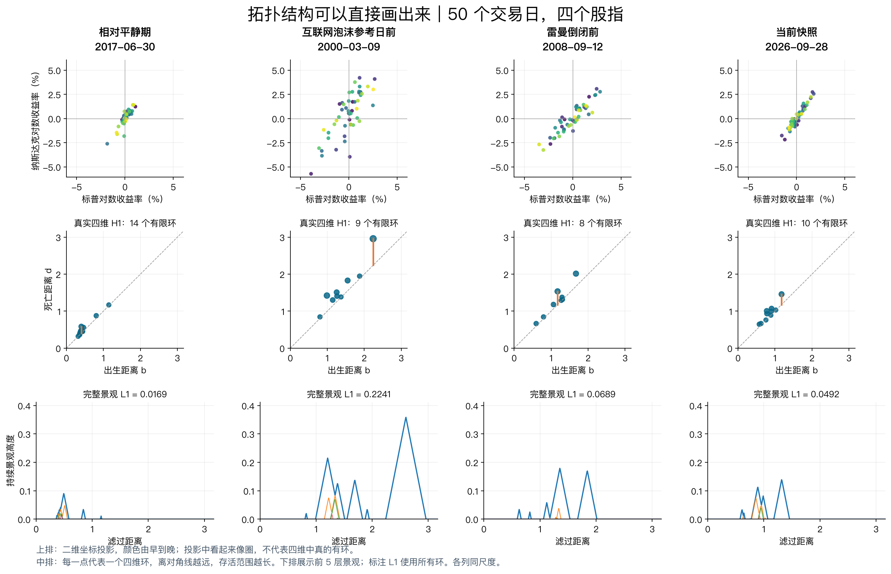
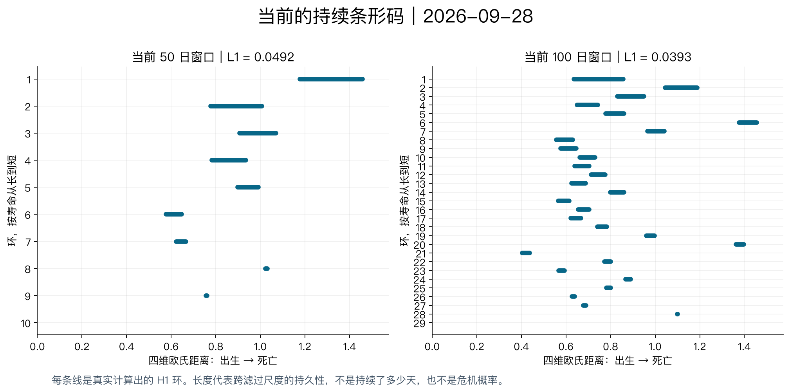
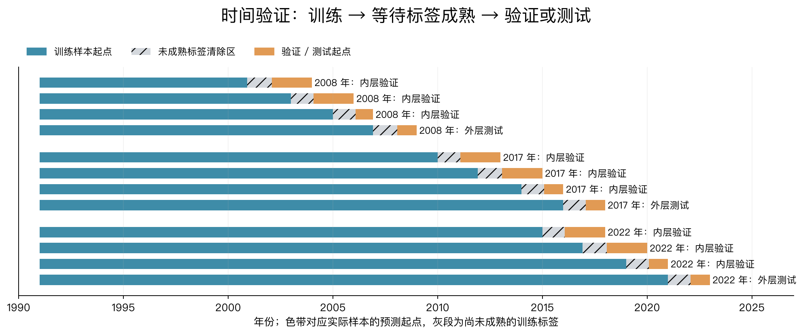
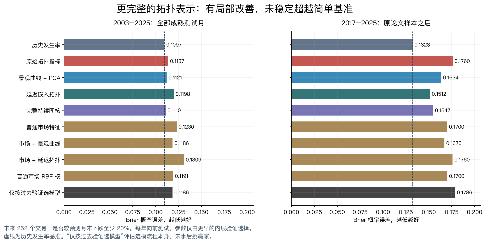
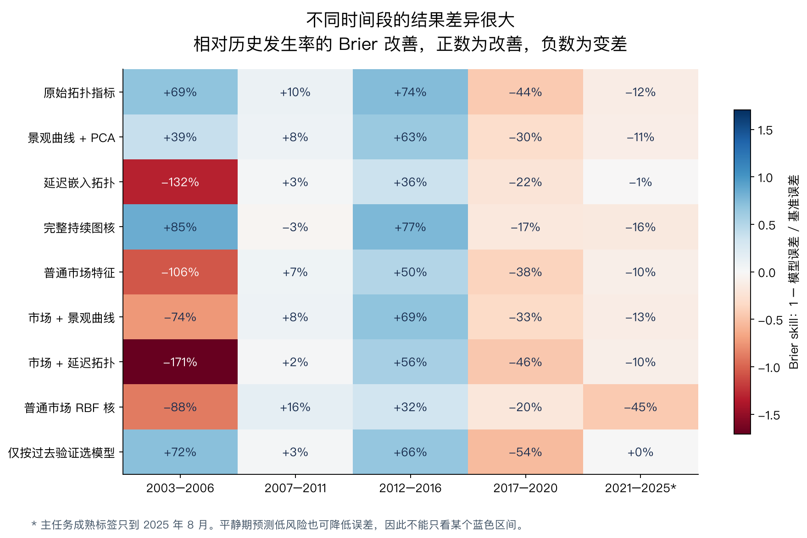

# 拓扑结构图与第二轮时间验证

分析快照：2026-09-28。已生成实际市场点云、持续图、景观、条形码，并完成文献驱动的第二轮预测比较。

**结论：拓扑结构可以直观显示。保留景观曲线、完整持续图或加入延迟嵌入，部分时期较原始指标有所改善；但这轮严格按时间选参数的检验，没有建立跨时期稳定的大幅预测提升，也没有找到可以交付为金融危机预测器的方法。**

这里使用原论文四股指路线和相关的延迟嵌入路线，未把任务转成宏观银行危机模型。本轮目标仍是未来股价损失，不与系统性银行危机标签混淆。

## 1. 拓扑现在能画出来吗

能。下图从左至右为相对平静期、互联网泡沫参考日前、雷曼倒闭前和当前，同样使用最近 50 个交易日，所有列共享坐标尺度。



读图方法：

- **上排是点云的二维投影。**每一天实际是四维点；画出的两个轴分别是标普与纳斯达克收益率。另两个维度参与全部拓扑计算。颜色从早到晚，原方法不会把点按时间连接成线。投影中看起来有圈，并不能证明四维里存在对应环。
- **中排是真实四维 H1 持续图。**每个点是一个环的出生距离 b 和死亡距离 d。越远离对角线，跨尺度寿命 d−b 越大。橙色线标示最长环的寿命。轴上的“出生/死亡”是距离，不是日历日期。
- **下排是持续景观曲线。**它把不同环变成可以比较和学习的函数。显示前 5 层，标注的 L1 则使用全部环，未只取图中几层。

2000 年前的点明显更远离对角线，景观峰更高。当前也有环，但强度低于所选两个历史事件前时点。平静期同样有短寿命环，所以环的存在或数量不能直接作为危机信号。

100 日版本见 `topology_visuals/structure_w100.png`，与 50 日版本分别使用同一组日期。

### 当前条形码



每条线表示一个计算出的环。50 日点云返回 10 条 H1 区间，100 日点云返回 29 条，很多极短；但 50 日 L1 为 0.0492，100 日 L1 反而为 0.0393。点数/窗口变大后，环的数量不能直接比较，更不能解释成危机更严重。

当前历史分位仍为前轮结果：50 日 85.3%，100 日 45.9%。这些是拓扑强度的历史位置，不是预测概率。

## 2. 本轮沿原理论做了哪些扩展

| 路线 | 为什么值得测试 | 本轮实际做法 |
|---|---|---|
| 持续景观函数 | 原始 L1 将整个形状压成一个数字，可能损失位置与层次信息 | H0/H1、50/100 日景观取固定网格，训练集 PCA8，再预测 |
| 完整持续图核 | 直接比较出生/死亡结构，减少压缩成单个范数的损失 | Sliced Wasserstein 距离、4 个 H0/H1×窗口通道、核岭回归 |
| 延迟嵌入拓扑 | 四股指点云不保留窗口内顺序；延迟嵌入把过去顺序编码进几何 | 标普收益率的四维过去延迟坐标，tau=1/5、50/100 点，使用水平及变化 |
| 联合及匹配基线 | 分辨收益来自拓扑、普通统计，还是学习器变化 | 市场+景观、市场+延迟，以及普通市场 RBF 核 |

优先采用 [Bubenik, JMLR 2015](https://jmlr.org/papers/v16/bubenik15a.html)、[Carrière–Cuturi–Oudot, ICML 2017](https://proceedings.mlr.press/v70/carriere17a.html) 的原始数学方法，并参照 [Katz & Biem 2021](https://www.sciencedirect.com/science/article/pii/S0378437121000881) 的时间分辨拓扑路线。数学稳定性与分类基准效果不等于金融预测成功。各篇论文的实际证据和限制见 `TOPOLOGY_LITERATURE.md`。

本轮是借鉴这些表示方法的独立实现，不是逐点复制它们的原始数据实验。尤其企业 CDS 数据没有取得，不声称复现了那部分研究。

## 3. 交叉验证怎样做

随机打散金融月份做 K-fold 不合适：相邻月份的未来一年标签大量重叠，容易让同一次危机的未来信息进入训练。这里采用嵌套的、向前推进的时间验证。

1. **外层**：从 2003 年开始，每年作为一个后续测试块；模型在年初仅用标签已完整到期的历史样本训练，预测这一年的月末。
2. **内层**：只在该外层年之前的数据里，最多取三段、每段两年的顺序验证块，选择正则化与核带宽。验证标签也必须在外层年初之前已成熟。
3. 缩放、PCA、核距离归一化全部仅拟合当折训练数据。未满预测期限的近期标签保持 UNKNOWN。
4. 两个期限：未来 252 个交易日相对预测月末损失至少 20%，以及未来 126 个交易日损失至少 15%。
5. 另测试一个实际可执行的“只按过去内层验证分数选模型”策略，避免看完外层结果再挑赢家。

共生成 **48 个年度×期限外层预测块**，其中 **47 个已有可评分的成熟标签**；**126 个内层时间验证折**。2003 年的两个期限没有满足样本要求的内层折，使用预先指定默认参数并明确标记 fallback。

主任务有 **272 个成熟月末预测、32 个正标签月**，评分期 2003-01 至 2025-08；辅助任务 278 月、34 个正标签月，评分至 2026-02。2017+ 主任务仍只有 104 月、16 个正标签月，主要对应少量危机/大跌事件。拟合次数再多，也不会把它变成几千场独立危机。



此前已经看过历史图，因此这是参数规则事先冻结的探索性时间回测，不是完全未见过数据的最终盲测。外层年份后来可以成为以后年份已经成熟的训练数据，这符合实时学习，不改变较早预测的来源。

## 4. 结果：局部改善，没有稳定的大幅提升

Brier 衡量概率预测误差，越低越好。下表中全部模型采用本轮相同时间切分。不要将其与第一轮每月重训、固定参数的数值直接相减来宣称进步。

| 主任务方法 | 2003 起全部测试月 | 2017 年以后 |
|---|---:|---:|
| 历史发生率 | **0.1097** | **0.1323** |
| 原始拓扑指标 | 0.1137 | 0.1760 |
| 景观曲线 + PCA | 0.1121 | 0.1634 |
| 延迟嵌入拓扑 | 0.1198 | 0.1512 |
| 完整持续图核 | 0.1110 | 0.1547 |
| 普通市场特征 | 0.1230 | 0.1700 |
| 市场 + 景观曲线 | 0.1186 | 0.1670 |
| 市场 + 延迟拓扑 | 0.1309 | 0.1760 |
| 普通市场 RBF 核 | 0.1191 | 0.1700 |
| 仅按过去验证结果选模型 | 0.1186 | 0.1786 |



2017+ 延迟拓扑较原始拓扑误差降低约 14%，持续图核降低约 12%，但仍落后于历史发生率。24 月移动块 bootstrap 的成对误差差区间均跨零：延迟拓扑对原始指标约 **[−0.0904,+0.0095]**，持续图核约 **[−0.0823,+0.0112]**。不能称为稳定显著提升。

在全部主任务测试月，完整持续图核是这批非平凡拓扑候选中 Brier 最低的版本，但仍比历史发生率差约 1.2%。若只看全期风险排序，普通市场 RBF 核 AUC 为 0.615，持续图核为 0.540；2017+ 却分别降至 0.298 / 0.274。因此不能选择一个有利指标或时期就宣布“最好的金融危机预测方法”。

辅助 6 月任务：全期历史频率 Brier 为 0.1099，持续图核 0.1102，原始拓扑 0.1123；2017+ 分别为 0.1326、0.1424、0.1539。仍未超越简单基准。

### 不同时期为什么必须分别看



图中正数/蓝色表示相对历史发生率改善，负数/红色表示更差。

- 2007–2011 这一段，原始拓扑 Brier 比发生率基准低约 10%，普通市场 RBF 核低约 16%。这与“某些危机类型中有用”相容。
- 2003–2006、2012–2016 有些方法误差很低，但平静期降低报警本身就能带来这个结果，不能直接叫成功预警。
- 2017–2020 多数方法明显变差，说明从以前时期学到的规则不能稳定覆盖后续大跌。
- 仅根据过去验证成绩选模型，在 2017+ 也没有改善。Cross-validation 可以揭示失败，不能保证每个新市场环境都有一个可预测的规则。

这是指定表示、学习器、数据与预测期限下的结果，不是证明所有拓扑方法无效，也不是覆盖了全部金融预测方法。

## 5. 这轮数学路线做到什么程度

已从“看一个范数”推进到“景观函数、H0/H1 完整持续图、时间延迟结构”，并完成时间上独立的内层选参与外层评价。现有证据更支持将它作为市场状态/结构描述工具；在当前四股指数据上，把它升级为 6–12 月尾部风险预测器仍未成功。

若继续保持拓扑主线，下一步优先顺序是：

1. **研究拓扑变化的过程，而非只比较单日状态。**例如相邻持续图的 Wasserstein 距离、变化速度，以及环形成和塌缩与下行状态的关系。要与普通协方差变化和变化点检测比较。此方向本轮尚未单独测试。
2. **扩大独立危机样本，同时保留同一种表示。**在不同国家股市或银行/行业数据上测试外部泛化；同一次全球冲击必须整组隔离。不能只在这组美国数据上不断加大搜索范围。
3. **把“局部异常”和“系统同步”都纳入解释。**H0/H1 的变化可以继续研究，但新增信息必须超过相关性、特征值、尾部共跌等更简单指标。

这些是可继续检验的候选，不是已证明能提高的下一版。未授权收费数据或外部计算，今天未采购企业 CDS 数据。

## 6. 实现限制与验证

- 景观表示使用固定前 5 层、[0,6] 的 64 点网格，并非完整无损曲线。430 个快照×4 个图中，共 14 条有限区间死亡尺度超过网格端点，最大约 8.108；涉及 11 个快照。已记录这一截断，没有为追求更好分数事后扩大网格。完整持续图核不受该景观截断影响。
- 持续图核使用 16 方向近似；12 组距离已与独立库 `persim.sliced_wasserstein` 核对一致。核岭输出经过 [0,1] 截断，并未另完成概率校准，因此不能把实验分数直接当实时风险概率。
- 3 组新单元测试覆盖距离性质、无未来值的延迟坐标及标签成熟清除。
- 3 个日期的表示仅用历史前缀重新计算，24 次外层模型仅用截断数据重新拟合，均与已存结果一致。
- 内外层所有成熟日期边界、相同测试样本、自动选模仅使用内层结果均通过核验。
- 原始数据与当前图沿用 2026-09-28 快照；没有重新抓取或修改前轮结论。

验证文件：`topology_cv_results/validation.json`。冻结协议与代码哈希：`topology_cv_results/manifest.json`。

## 7. 文件与复现

```sh
.venv/bin/python topology_visuals.py
OPENBLAS_NUM_THREADS=1 OMP_NUM_THREADS=1 .venv/bin/python topology_cv.py
OPENBLAS_NUM_THREADS=1 OMP_NUM_THREADS=1 .venv/bin/python verify_topology_cv.py
.venv/bin/python topology_cv_figures.py
.venv/bin/python -m pytest -q
```

- `topology_visuals/`：实际点云、持续图、景观、条形码及快照数据。
- `topology_cv_results/predictions.csv`：所有外层预测和 UNKNOWN。
- `topology_cv_results/selection.csv`：每年内层分数、参数选择、默认回退标记。
- `topology_cv_results/metrics.csv`：逐年、分段及汇总指标。
- `topology_cv_results/bootstrap.csv`：预先指定的成对比较区间。
- `TOPOLOGY_LITERATURE.md`：文献依据及不能外推的范围。

## 证据台账

| 主张 | 状态 | 证据 |
|---|---|---|
| 历史及当前市场拓扑结构已可视化 | 已完成 | `topology_visuals/snapshot_data.json` 与图 |
| 更丰富拓扑表示相对原范数在部分时期改善 | 已观察，稳定性不足 | `metrics.csv`、`bootstrap.csv` |
| 已得到大幅、稳定的危机预测提升 | 未支持 | 全期、2017+ 与简单基准比较 |
| 嵌套选参流程能自动找到可靠赢家 | 本轮未支持 | `inner_selector` 外层成绩 |
| 扩展市场/拓扑变化速度可能有效 | 尚待检验 | 本报告第 5 节，不作为已完成实验 |
